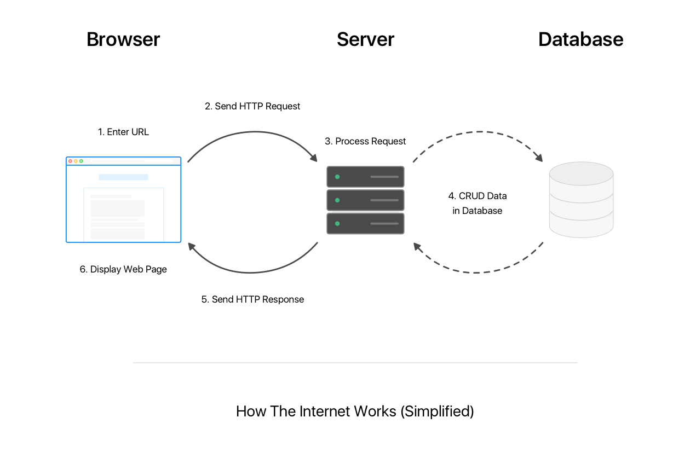

Stop for a moment and think of your favorite website. If you don't have one, think of the one you go to the most.

Once you have a website in your head, try to remember, in as much detail as possible, the last time you visited that website. What happened?

You might not even remember because it's become so second-nature, but your experience probably looked like this:

1. Open web browser of choice.
1. Type in the web address (URL) of the website.
1. Wait for the web page to load. Usually takes about 1 second (but sometimes feels like forever!)
1. Begin reading, clicking, watching, scrolling on your merry way.

Seems simple huh? So simple that it's easy to overlook all the crazy things that need to happen for this to work.

In this section, we'll look at what happens from the moment you finish typing the web address and hit enter!

# Explain Like I'm 5: How the Internet Works

Most explanations of _How the Internet Works_ are confusing and involve big technical words that scare away beginners. Let's take a different approach.

Rather than dive into deep technical concepts right away, we'll first focus on the "big picture" concepts of the internet works. In addition, we'll try our best to break it down so even a 5-year-old could understand it!

> [info]
>
The diagram above is simplified in order to teach the most important concepts for full-stack web development. Depending on how in-depth you want to go, you could spend months learning about the specific details of how the internet works.

Let's look at the diagram above and go through each step one at a time:

### 1. Enter URL

A user types a URL into the browser's address bar. The browser uses this URL to build a HTTP request and find out where it should send it. A HTTP request contains information about what the user is trying to do. In our case, our user's desired action is to visit a web page.

### 2. Send HTTP Request

Once the HTTP request is sent out by the browser, the HTTP request travels through a network of underground wiring until it eventually reaches the correct web server.

### 3. Process Request

The web server is a special type of computer that runs web applications. Once the server receives the HTTP request, the web app running on the server will look at all the information within the request and decide what to do with it. Programmers write code that determines what the web app will do with each incoming HTTP request.

Once the request is processed, the web app will decide whether it needs to access the database. If it does, it'll access the database to perform a CRUD operation, otherwise it'll skip accessing the database (step 4) and send a response back to the user directly (step 5).

> [info]
>
CRUD stands for Create, Read, Update, Delete. HTTP requests will often ask the web application to create, read, update, or delete data from the database.

### 4. (OPTIONAL) CRUD Data from Database

The database is where all of the web application's data is stored. Based on the previous step, the web app may access the database to create, modify or delete data.

### 5. Send HTTP Response

The server sends a HTTP response back to the user that contains information on what the browser should do next.

### 6. Display Web Page

The browser retrieves the code and information inside of the HTTP response and displays it as a web page back to the user.

That wasn't so bad was it? Do you think a 5-year-old would understand it?

> [info]
>
Just to re-emphasize, this explaination is greatly simplified to get across all the important concepts you'll need to know for building your own web apps.

# Our Technology Stack

Now that you have a mental model of _how the internet works_, we can talk about the technologies we'll use to build web applications and how each of them fit into the big picture.

In our web curriculum, you'll be using the following technologies:

Front-end

1. HTML
2. CSS
3. JavaScript (Browser)

Back-end

4. NodeJS (JavaScript)
5. ExpressJS
6. MongoDB

Let's look at how each technology fits into our simplified model of the internet:

As you can see in the diagram above, each technology has it's own purpose and responsibility.

On the front-end, we'll need to use HTML, CSS and JavaScript (Client) to build the websites that users will see and interactive with.

One the back-end, we'll use technologies like NodeJS, ExpressJS to build out our web app and MongoDB to store our data.

By learning to build and use these technologies together, we'll be well on our way to becoming seasoned full-stack web developers!

> [info]
>
In web development, we use the term client to refer to a device that sends and receives requests from a web server. In our context, we'll be using the term client to refer to the browser, but it could also be a phone, table, or smart toaster!

# Up Next

At this point, we've built a mental model of how the internet works. These concepts will guide us as we progress through the tutorials and learn each part of the technology stack.

<!-- TODO: ask student to remember each step and compare back to diagram -->
<!-- Take a moment and try to remember each of the six steps and what they do in our HTIW diagram. -->

In the upcoming section, we'll use the Chrome Developer Tools to get a better understanding of the front-end technologies and how they work!
