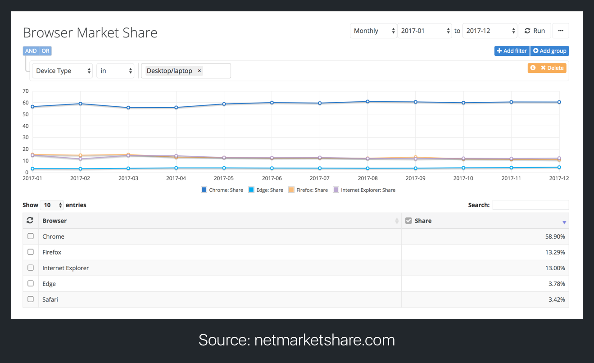
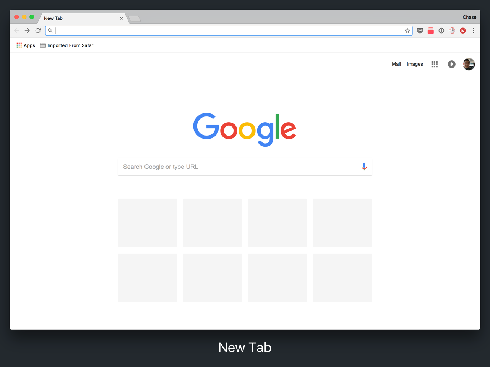

Before we start, we'll need to install the popular web browser: [Google Chrome](https://www.google.com/chrome/).

You're probably familiar with the web browser. In fact, right now, you're viewing this tutorial through a web browser.

A browser allows you to view websites on the internet, but it'll also allow us to view, test and interact with the code we're going to write.

# Why Google Chrome?

Google Chrome is a popular choice for many web developers. Not only is it available on every major platform, it also has a whoppin' 58.9% market share. That means roughly 60% of users will visit your website through a Chrome browser, with Firefox trailing in second place at 13.3%.

You might not know this, but each different web browser (Chrome, Firefox, Safari) will display the code of a website a little differently. We want to use Chrome as we test and develop because it'll allow us to make sure the wide majority (holy 60%!) have a good user experience.

> [info]
What is does *user experience* mean?
>
In product development, the term user experience, or UX, is used to describe how a user feels after interacting with a product or service. When you start building, try to keep your users in mind and think about how they'll feel when using your web apps.

Another reason many developers prefer Chrome is because of _Chrome Developer Tools_. Dev tools, as the name implies, are tools for developers. They allow us to view, test and interact with our code in the Chrome browser. Google has invested a lot of time and resources into creating their dev tools. We'll learn more about them in the section _Chrome Developer Tools_.

# Downloading Chrome

> [info]
If you've already installed Chrome on your computer, make sure it's updated to the latest version before continuing onto the next section, _How The Internet Works_.

To download Google Chrome, find your operating system and follow the corresponding set of instructions below:

## Install Chrome on Windows
1. Download the [installation file.](https://www.google.com/chrome/)
1. If prompted, click *Run* or *Save*.
1. If you chose *Save*, double-click the download to start installing. 
1. Start Chrome:
  - *Windows 7:* A Chrome window opens once everything is done.
  - *Windows 8 and 8.1:* A welcome dialogue appears. Click Next to select your default browser.
  - *Windows 10:* A Chrome window opens once everything is done.

## Install Chrome on Mac
1. Download the [installation file.](https://www.google.com/chrome/)
1. Open the file called 'googlechrome.dmg'.
1. In the window that opens, find Chrome.
1. Drag Chrome to the Applications folder.
  - You might be asked to enter the admin password.
  - If you don't know the admin password, drag Chrome to a place on your computer where you can make edits, like your desktop.
1. Open Chrome.
1. Open Finder.
1. In the sidebar, to the right of Google Chrome, click Eject.

## Install Chrome on Linux
1. Download the [installation file.](https://www.google.com/chrome/)
1. To open the package, click *OK*.
1. Click *Install Package*.

For reference, you can find the documentation [here](https://support.google.com/chrome/answer/95346).

After successfully downloading Google Chrome, open it. 

You should see the 'New Tab' that looks like the following:

With Chrome installed, let's begin our dive into _How The Internet Works_ in the next section.
